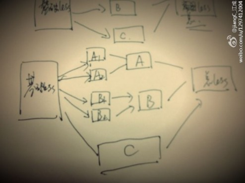

#序（持续更新）

##文件组织
less文件包含两部分：（从文件组织角度考虑）

+ 函数
+ class

函数分为：

+ 基本。基于组件，组件内部特有的函数。
+ 通用。组件间提取出来，在组件之间可以使用。

class分为：

+ 基本。这部分class提供最基本的组件样式完整展示。
+ 扩展。这部分class属于定制，在业务中可能有许多定制的部分，如给Button加上箭头。突破基本样式的以扩展class形式展现。

##和之前的区别

最重要的几个衡量指标：灵活性，可扩展性，可维护性。

###h5

	1.多用class标签；
	2.级联和DOM结构关联度较高；
	3.总的域名空间#tbh5v0；
	4.实现方式容易理解；
	5.业务关联度高:比如说页尾，Less结构：
	.footer{
		a{
		}
		.footer-t{
			.user-info{}
			.gotop{}
			
		}
		.footer-l{
		}
		.copyright{
		}
	}
	
	6.和bootStrap比较起来H5的less结构稍显混沌：如下代码：
	.c-list-sort{
		&:after{}
		li{
			&.highlight{}
			&.sort-asc, &.sort-desc  {
				label{}
				span{}
				em{
					&:first-child{}
					&:last-child{}
				}
			}
			&.sort-asc{
				em{
					&:first-child{}
					&:last-child{}
				}
			}
			&.sort-desc{
				em{
					&:first-child{}
					&:last-child{}
				}
			}
		}
		
	}
	
	再比如分页：
	.c-pnav-con{
		a{}
		ul{
			li{}
			
		}
		.c-p-sec{
			div{}
			.tri(){
				a{}
				.c-p-p{
					em{}
				}
			}
		}
		
		.c-p-pre{}
		.c-p-next{}
		.c-p-cur{
			.c-p-arrow{
				span:first-child{}
			}
			.c-p-down{
				span:last-child{}
			}
			.c-p-up{
				span:last-child{}
			}
		}
		
		.c-p-grey{
			a{}
		}
		
		.c-p-select{}
	}
	
	盘根错节的结构，几乎没有什么维护性可言。
	
	
###TaobaoPad
	1.独立控件 独立命名空间，结构清晰，如text控件：
	#c-text {	
		//空间内的公用函数
		.circle(@w) {}
		.pack-text(@w: 298px, @h: 33px) {}
		
		//空间内的基本样式class和样式扩展
		.c-text {}
	}
	
	//公共样式.
	.c-XXX{}
	
	2.相似功能函数分布在不同的控件的命名空间下，各自维护，耦合低，灵活度高，但当一个人维护代码（集中维护）时需要维护多份相同code。
	3.扩展上来说，由于单个控件内单个func，扩展起来互不打扰。
	

###bootStrap
	
	1.样式集中在标签的功能部分，比如input只考虑foucs，disable，required等等。所有的这些考虑都是从input的功用出发。
	2.兼容性处理，这块做的比较多。除了浏览器兼容以外，还有“遵循‘One class, multiple tags”。
	3.比较少的class标签，更多的是元素选择器标签，从功能上来说，比之H5，业务耦合很低	。
	4.不可避免的DOM结构。要实现某些表现形式，需要按照约定的DOM结构来，这点和H5比较类似。但是约定强度依然比较低。
	5.集中式抽取公共func，设计上麻烦些，而且有可能面对扩展的风险。

<ref name="1.JPG"></ref>

如上图，TaobaoPad的内容集中在控件。bootStrap由于抽出一部分func集中管理。因此控件大小在各个结构中就显得“瘦”和“胖”。

**再一个问题：LESS文件输出问题**

假设文件结构如下图:

基础LESS：

	.base{
	    text-align:e("base");
	}

a1.less:
	
	@import "base";

	.a1{
	    text-align:e("a1");
	}

a2.less

	@import "base";

	.a2{
	    text-align:e("a2");
	}

a.less

	@import "a1";
	@import "a2";

	.a{
	    text-align: e("a");
	}
	
b1.less

	@import "base";

	.b1{
	    text-align:e("b1");
	}

b2.less
	
	@import "base";

	.b2{
	    text-align:e("b2");
	}
	
b.less

	@import "b1";
	@import "b2";

	.b{
	    text-align: e("b");
	}
	
c.less

	@import "base";

	.c{
	    text-align:e("c");
	}
	
output.less
	
	@import "a";
	@import "b";
	@import "c";
	.output{
	    text-align:e("output");
	}

最终生成的CSS文件如下：

	.base{text-align:base;}
	.a1{text-align:a1;}
	.base{text-align:base;}
	.a2{text-align:a2;}
	.a{text-align:a;}
	.base{text-align:base;}
	.b1{text-align:b1;}
	.base{text-align:base;}
	.b2{text-align:b2;}
	.b{text-align:b;}
	.base{text-align:base;}
	.c{text-align:c;}
	.output{text-align:output;}
	
**即最终输出文件包含5个base.less文件，而不是想要的一个**

综合比较，由于bootStrap是通用库，其中会使用很多标签选择器：如from中对legend的定义：
	
	// Groups of fields with labels on top (legends)
	legend {
	  display: block;
	  width: 100%;
	  padding: 0;
	  margin-bottom: @baseLineHeight;
	  font-size: @baseFontSize * 1.5;
	  line-height: @baseLineHeight * 2;
	  color: @grayDark;
	  border: 0;
	  border-bottom: 1px solid #e5e5e5;

	  // Small
	  small {
	    font-size: @baseLineHeight * .75;
	    color: @grayLight;
	  }
	}

> 从使用自由度而言：标签选择器的使用会降低自由度，而class更灵活一些。除非在已知而且DOM结构不频繁发生变化的DOM中，标签选择器是一个选择。

bootStrap中的这种方式降低了一定的自由度。对设计的要求较高。

##规范化

###命名

命名规范，在控件Class命名上基本上和规范靠近。而且命名要具有一定的“辨识度”。

如Accordion、carousel所代表的意思和控件是什么？？？

####class 命名

####函数命名

####变量命名

尽量保持语义：如：

	@sansFontFamily:        "Helvetica Neue", Helvetica, Arial, sans-serif;
	@btnBackground:                     @white;

###组件样式规范（从组件角度考虑）

这部分主要处理组件的必要属性定义，分为Core、basic、extend几个部分。

+ Core部分，一个组件能够展现的最基础的部分（这里的说的最基础，可能不是组件的物理属性，而是应用中最常使用的部分）。如Button的边框，圆角。（这些属性在项目使用很频繁）
+ basic部分，如长、宽，背景色、文字颜色、阴影等等。
+ extend部分，这部分根据业务的具体需要有一定的“定制”成分。如给Button加个箭头，这里可能就需要修改Button的DOM结构，此类以CLass形式专门提供

	
##处理兼容问题	

此处暂时只支持webkit，故兼容性问题只在不同的webkit的版本和浏览器之间考虑。

##函数设计问题

如何设计一个函数，一个组件的函数应改考虑哪些方面？

+ 基本&针对性，一些属性是组件的通用的属性，这一部分可以单独设计，而一些属性是某些组件特有的“属性”，这部分可以通过函数形式Mixin进来。
+ 可用性，可用性要高，在使用时要保证尽可能的方便。
+ 扩展性，面对可能变化的需求，需要留出一定的扩展的空间。特别在结构上，不能没有扩展性。
+ 复用性，保证一些常用函数的比较好的复用性，维护代码简洁度。

####less函数的作用

+ 用作hack

+ 用作合并（mixin）

####处理扩展性

**Q：**如果在一个less function中遇到一个自认为不需要重写的属性，但是在后续的开发中又需要单独扩展，该如何处理？？
如下代码：

	.btn {
	  display: inline-block;
	  .ie7-inline-block();
	  padding: 4px 12px;
	  margin-bottom: 0; // For input.btn
	  font-size: @baseFontSize;
	  line-height: @baseLineHeight;
	  ...

**A：**正如你看到的，bootstrap把可能会变化的部分都改成了变量。然后就可以生成不同版本的控件。

**Q：**如果使用者在使用v0.1按钮组件：
	；字体大小为14px
	；行高为18px
	在v0.2的版本中，由于需求原因，字体和行高改成如下：
	；字体大小为12px
	；行高为14px
	（附：某些属性是有很大的联动特征的，如这里的字体大小和行高）
	但是某个使用者想使用v0.1的字体大小，和v0.2的行高，怎么办？？？
	
**A：**对不起，版本一旦固定，不提供组件级别的修改，可以在自己的应用针对的修改覆盖。

**Q：**一些扩展可以通过变量实现，也可以通过class实现，两者如何区分？
**A：**变量是相对不变的（在版本和版本之间的变化），而class则是对业务的扩展，一个还是在原来的“坑”，一个是挖了很多“坑”。而两者都表现在版本的更迭中。

####技巧(tricks)

1.通配符。

	[class^="icon-"],
	[class*=" icon-"] {
	 	display: inline-block;

2.Mix in
	
	input[type="button"] {
	  &.btn-block {
	    width: 100%;
	  }
	}

一个DOM元素在CSS中有多种选择方式：
+ class
+ 标签
+ 选择符（关系、属性、伪类等）
+ ID

结合使用可以实现定制。

##变量定义

bootStrap按以下几个部分对变量进行了划分：

主要划分标准：
	
	控件
	颜色
	尺寸

+ Grays
+ Accent colors(浓色)
+ Scaffolding
+ Links
+ Typography
+ Component sizing（Based on 14px font-size and 20px line-height）
+ Tables
+ Buttons
+ Forms
+ Dropdowns
+ Z-index master list(COMPONENT VARIABLES)
+ Sprite icons path
+ Input placeholder text color
+ Hr border color
+ Horizontal forms & lists
+ Wells
+ Navbar
+ Pagination
+ Hero unit
+ Form states and alerts
+ Tooltips and popovers
+ GRID

##组件

###Form

1.最基本的布局、字体、排版属性。
2.不可编辑、不可用
3.获得焦点

###Button

class

func

bootStrap的设计方式是选择符+class。
1.基本标签：

	label,
	input,
	button,
	select,
	textarea

input展开：

	input[type="text"],
	input[type="password"],
	input[type="datetime"],
	input[type="datetime-local"],
	input[type="date"],
	input[type="month"],
	input[type="time"],
	input[type="week"],
	input[type="number"],
	input[type="email"],
	input[type="url"],
	input[type="search"],
	input[type="tel"],
	input[type="color"]
	input[type="radio"],
	input[type="checkbox"]
	input[type="file"],
	input[type="image"],
	input[type="submit"],
	input[type="reset"],
	input[type="button"],
	input[type="checkbox"]

select展开：
	
	select[multiple],
	select[size]

2.class命名：

	uneditable-input
	uneditable-textarea
	
3.DOM约定与灵活性

	<label class="checkbox">
	  <input type="checkbox" value="">
	  Option one is this and that—be sure to include why it's great
	</label>
	 
	<label class="radio">
	  <input type="radio" name="optionsRadios" id="optionsRadios1" value="option1" checked>
	  Option one is this and that—be sure to include why it's great
	</label>
	<label class="radio">
	  <input type="radio" name="optionsRadios" id="optionsRadios2" value="option2">
	  Option two can be something else and selecting it will deselect option one
	</label>
	
**Q:**如这里的class “checkbox”　“radio”为了实现内部DOM展示完整，在原来的input标签外多加了一层label,是否影响灵活性（比如单独使用一个radioButton）？

**A:**这只是一种扩展，最基础的input标签的样式还是提供的，扩展Code（本例的扩展是因为要求好的DOM展现效果，属于DOM级别扩展）如下：

	.radio,
	.checkbox {
	  min-height: @baseLineHeight; // clear the floating input if there is no label text
	  padding-left: 20px;
	}
	.radio input[type="radio"],
	.checkbox input[type="checkbox"] {
	  float: left;
	  margin-left: -20px;
	}

##处理冲突

当前的样式和应用的样式的命名冲突的问题。

###命名空间

bootStrap使用到命名空间，这些使用命名空间的func的特点就是有个逻辑上的“所属”关系，与class稍有不同。使用命名空间的好处之一就是：1.友好的数据组织；2.调用的明确性。但是如果在应用中，会不会和应用中的标签冲突？bootStrap在命名上貌似尽可能规避了。。

	#font {
	  #family {
	    .serif() {
	      font-family: @serifFontFamily;
	    }
	    
	...
	
	#grid {

	  .core (@gridColumnWidth, @gridGutterWidth) {

	    .spanX (@index) when (@index > 0) {
	      (~".span@{index}") { .span(@index); }
	      .spanX(@index - 1);
	    }

##扩展

分为样式扩展和DOM扩展

###样式扩展

如前文所述，样式扩展直接增加定制class

###DOM扩展

需要在已有的组件上修改或者增加DOM结构，这些操作尽量不要出现，如果一旦出现，处理方式？

	