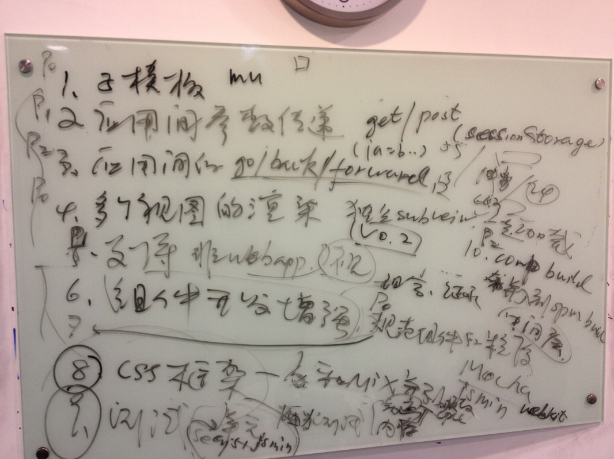

# v0.2 **version**

##开发计划

资源：3人

周期：11.26~12.17

##功能点

###子模板功能 P0

在mu文件中，通过<template />标签可以设置多个模板，通过id，可以获取对应的模板。当不存在<template />标签时，整个mu文件被认为是一个模板。

###多个视图独立渲染功能 P0

一个APP（Controller）可以对应多个View，这些多个View互相独立，且可以通过被独立渲染。

###Template和Model的绑定 P1

分拆现有View和Component中的Data，成为独立的Model对象。并和Template绑定。

###应用间参数传递 P1

* `GET`-通过在hash后面增加!a=b&c=d的方式。
* `POST`-记录sessionStorage中，并维护一个hash->object的键值对来管理post数据。

###支持非webapp的开发 P1

提供非webapp的APP（Controller）管理器，来支持非webapp的开发。

###优化APP的导航功能 P2

优化go/forward/backward功能。

##问题？

###需要规范组件的细粒度

会遇到如下一些问题

* 组件实例化太多。增加管理成本。
* 组件渲染在模板解析之后，有点拖沓。

不应该所有视觉元素都应该被制作成组件，需要规范组件的开发。

###MVVM探讨

* MVVM的框架：knockout，emberjs，win8 js……
* MVVM是否真的时候我们的框架？只要能解决我们的开发问题，MV whatever都可以。

###怎样做测试

* 单元测试：Node端的测试框架（Mocha）；Seajs新版本中，有加入jsmin的计划。
* 压力测试：内存？CPU？FPS？这些技术参数，需要浏览器插件支持，那么移动端的测试应该如何进行？

###组件的build是否可以简化

组件的build需要经过comp build和spm build两部，是否可以整合到spm中？
spm中是否能支持中间件的开发？

###CSS框架

CSS框架应该是和MIX JS框架并行的一个项目，参考bootstrap的CSS框架，来完成拥有扩展性的base css框架。基于base可以创建各种风格的skin。

